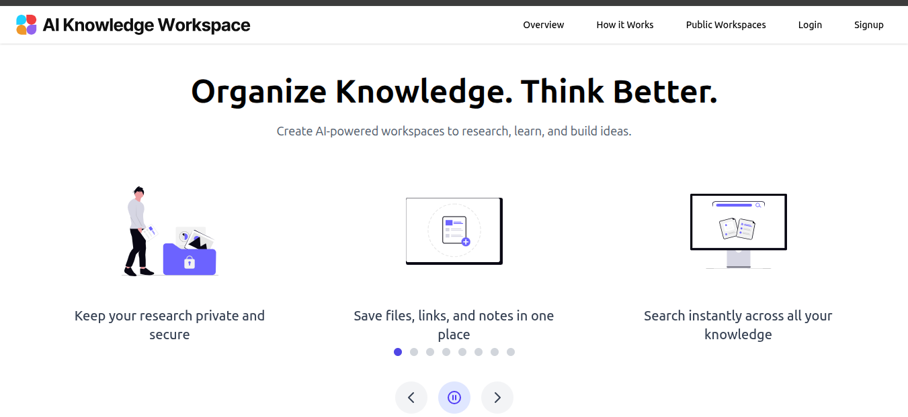
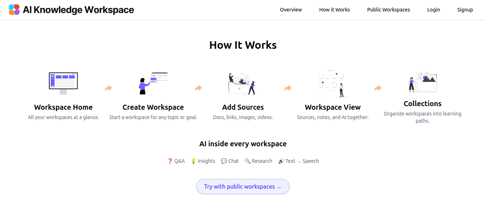
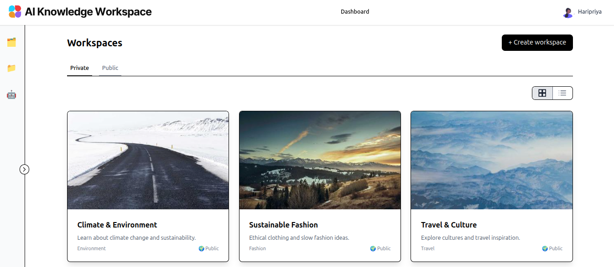

# 🧠 AI Knowledge Workspace

> An AI-powered personal knowledge management platform — store, organise, and interact with your learning materials using AI.


---

## 📌 Overview

**AI Knowledge Workspace** is a full-stack, production-style platform where users can:

- 📂 Create and manage personal **knowledge workspaces**
- 📄 Upload files (PDFs, images, links, notes) — stored securely in **AWS S3**
- 🤖 Use **AI tools** inside each workspace: summaries, Q&A, flashcards, and quizzes
- 🌍 Browse **public workspaces** without logging in
- 🔐 Access **private workspaces** securely via JWT authentication
- 📋 **Project managed with GitHub Projects** — [View AI Workspace Board →](https://github.com/users/haripriya91/projects/2)

---

## 📸 Screenshots

> 🚧 Actively in development

### 🌍 Public Overview


### 🔄 How It Works


### 📊 Public Dashboard


---
> 💡 **Live demo coming soon** — AI features (Q&A, summaries, flashcards) in Phase 2
```

---

## 🏗️ Architecture

```
┌─────────────────────────────────────────────┐
│              Frontend (Angular)              │
│     TypeScript · Tailwind CSS · JWT Auth     │
└─────────────────┬───────────────────────────┘
                  │ HTTP / REST API
┌─────────────────▼───────────────────────────┐
│             Backend (NestJS API)             │
│  ┌──────────┐ ┌──────────┐ ┌─────────────┐  │
│  │   Auth   │ │Workspace │ │  AI Module  │  │
│  │  Module  │ │  Module  │ │  (Phase 2)  │  │
│  └──────────┘ └──────────┘ └─────────────┘  │
│  ┌──────────┐ ┌──────────┐                  │
│  │   User   │ │   File   │                  │
│  │  Module  │ │  Module  │                  │
│  └──────────┘ └──────────┘                  │
│              Prisma ORM                      │
└────────┬──────────────┬───────────────────┬─┘
         │              │                   │
┌────────▼───┐  ┌───────▼──────┐  ┌────────▼──────┐
│ PostgreSQL │  │   MongoDB    │  │    AWS S3     │
│  (Docker)  │  │  (AI logs)   │  │ (File Store)  │
└────────────┘  └──────────────┘  └───────────────┘
                                          │
                              ┌───────────▼──────────┐
                              │    LLM Provider      │
                              │  OpenAI API / Other  │
                              └──────────────────────┘
```

---

## ⚙️ Tech Stack

### Frontend
| Technology | Purpose |
|---|---|
| Angular + TypeScript | SPA framework, component architecture |
| Tailwind CSS | Utility-first responsive styling |
| JWT + Angular Guards | Route protection & auth token management |
| Angular Interceptors | Automatic auth headers on API calls |

### Backend
| Technology | Purpose |
|---|---|
| NestJS | Modular, scalable Node.js framework |
| Prisma ORM | Type-safe database access layer |
| JWT (Access Tokens) | Stateless authentication |
| Class-validator | DTO validation & error handling |

### Data & Storage
| Technology | Purpose |
|---|---|
| PostgreSQL (Docker) | Primary relational database |
| MongoDB | AI logs & unstructured content |
| AWS S3 | Secure file storage (PDFs, images) |
| AWS IAM | Permission & access management |

### DevOps & Infrastructure
| Technology | Purpose |
|---|---|
| Docker + Docker Compose | Containerised local development |
| GitHub Actions | CI/CD pipeline automation |
| AWS | Cloud infrastructure & deployment |

### AI Layer *(Phase 2)*
| Technology | Purpose |
|---|---|
| OpenAI API / LLM provider | AI content generation |
| Prompt templates | Structured, consistent AI interactions |
| Workspace context | Personalised AI responses per user |

---

## 🔐 Access Control

```
┌──────────────────────┬──────────────┬──────────────────────┐
│ Feature              │ Logged Out   │ Logged In            │
├──────────────────────┼──────────────┼──────────────────────┤
│ Browse public spaces │     ✅       │         ✅           │
│ Create workspace     │     ❌       │         ✅           │
│ View private space   │     ❌       │  ✅ (owner/member)   │
│ Upload files         │     ❌       │         ✅           │
│ Use AI tools         │     ❌       │         ✅           │
└──────────────────────┴──────────────┴──────────────────────┘
```

---

## 🚀 Quick Start

```bash
# Clone and start
git clone https://github.com/haripriya91/ai-knowledge-workspace.git
docker-compose up -d

# Backend
cd backend && npm install && npm run start:dev

# Frontend
cd frontend && npm install && ng serve
```

---

## 📋 Project Management

This project is managed using **GitHub Projects** with a structured Agile board:

- 🗂️ Epics broken into user stories and tasks
- 📌 Backlog, In Progress, In Review, Done columns
- 🔗 Issues linked directly to code commits and PRs

[](https://github.com/users/haripriya91/projects/2/views/1)

---

## 📋 Development Roadmap

### Phase 1 — Core Platform *(In Progress)*
- [x] Angular frontend — routing, layout, auth UI
- [x] Public workspace browsing
- [x] Private dashboard & workspace management UI
- [ ] NestJS backend — Auth, Workspace, File modules
- [ ] PostgreSQL schema with Prisma migrations
- [ ] AWS S3 file upload integration
- [ ] Docker Compose full setup
- [ ] GitHub Actions CI/CD pipeline

### Phase 2 — AI Features
- [ ] OpenAI API integration
- [ ] Document summarisation
- [ ] AI-powered Q&A on uploaded content
- [ ] Flashcard & quiz generation
- [ ] Workspace-aware AI context (RAG pipeline)

### Phase 3 — Polish & Scale
- [ ] Refresh token support
- [ ] Real-time collaboration
- [ ] Advanced search across workspaces
- [ ] Performance monitoring & optimisation

---
## 👩‍💻 Author

**Haripriya Pushpamangalam Kesavan**
Fullstack Developer · Munich, Germany

[](https://linkedin.com/in/haripriya-pk)
[](https://github.com/haripriya91)

---

## 📄 License

This project is for portfolio and learning purposes.

---

> *Built with ❤️ to demonstrate real-world fullstack + cloud + AI engineering skills*